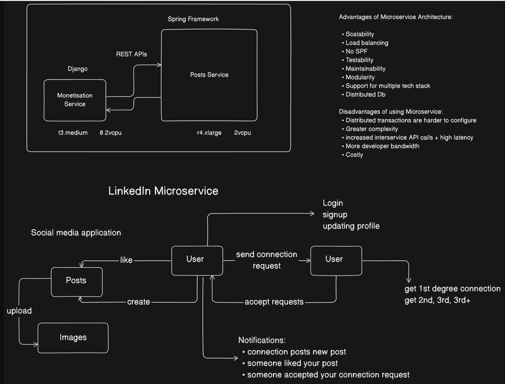
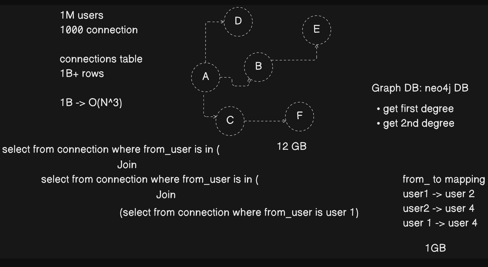
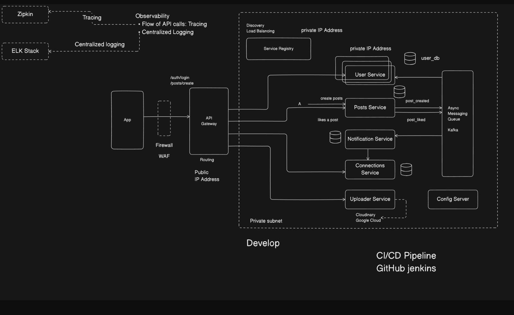

# 📌 ConnectIn – Microservice Architecture

A **LinkedIn-style social networking platform** built with a **modern microservice architecture**.  
ConnectIn is designed for **scalability, high availability, and real-time performance**, handling **millions of users** and **billions of social graph connections** efficiently.  

---

## 🚀 Features
- 🔑 **User Authentication & Authorization** – JWT-based, stateless & secure  
- 📝 **Post Service** – Create, like, and share posts  
- 🖼️ **Uploader Service** – Upload & manage images/videos (Cloudinary + Google Cloud)  
- 🔔 **Notification Service** – Real-time notifications (likes, comments, connection requests)  
- 🤝 **Connections Service** – Manage connections (1st, 2nd, 3rd+ degree)  
- 📊 **Graph Database (Neo4j)** – Sub-second traversal for 1B+ connections  
- 📩 **Event-Driven Architecture (Kafka)** – Async messaging for loose coupling  
- ⚡ **CI/CD Pipeline** – Automated builds & deployments (GitHub + Jenkins)  
- 🛡️ **Firewall (WAF) + API Gateway** – Secure routing & service discovery  
- 🔍 **Observability** – Centralized logging (ELK) & distributed tracing (Zipkin)  

---

## ⚙️ Tech Stack
- **Backend:** Java, Spring Boot, Spring Cloud, Django (Monetization Service)  
- **Databases:** Neo4j (Graph DB), PostgreSQL/SQL (structured data)  
- **Messaging Queue:** Apache Kafka  
- **Infrastructure:** Docker, Kubernetes (K8s)  
- **CI/CD:** GitHub, Jenkins  
- **Observability:** ELK Stack (logging), Zipkin (tracing)  
- **Storage:** Cloudinary, Google Cloud  
- **API Style:** RESTful APIs  

---

## 📂 Microservices Overview
- 👤 **User Service** – Authentication, profiles, connection management  
- 📝 **Posts Service** – Manage posts, likes, comments  
- 🤝 **Connections Service** – Handles graph queries (1st, 2nd, 3rd+ degree)  
- 🔔 **Notification Service** – Event-driven alerts  
- 🖼️ **Uploader Service** – Media uploads (images/videos)  
- ⚙️ **Config Server** – Centralized configuration  
- 🚪 **API Gateway** – Request routing, WAF protection  

---

## 🔑 Why Neo4j (Graph DB)?
- Social networks need **deep relationship traversal** (friends of friends, mutual connections, recommendations).  
- In **RDBMS** → multiple costly joins **O(N³)** over billions of rows.  
- In **Graph DB** → nodes + relationships enable **near real-time traversals** (1st, 2nd, Nth-degree).  
- ✅ Achieved **60% faster queries** and **reduced storage needs**.  

---

## 📌 Key Highlights
- 📨 **Event-driven microservices (Kafka)** → High availability & loose coupling  
- ⚡ **60% faster graph queries** using Neo4j (vs SQL joins)  
- 🚀 **CI/CD reduced deployment time by 87%** (2 hrs → 15 mins)  
- 🔍 **Distributed tracing (Zipkin)** → 50% faster error resolution  
- ☁️ **Dynamic scaling with Docker + Kubernetes** → 99.9% uptime  

---

## 🖼️ Architecture Diagrams
Here are the high-level design and architecture diagrams for **ConnectIn**:  

### 🔹 High-Level Architecture  
  

### 🔹 Graph DB vs Relational DB  
  

### 🔹 Microservices Architecture  
  

---

✨ Built with ❤️ for scalability, reliability, and performance.  
